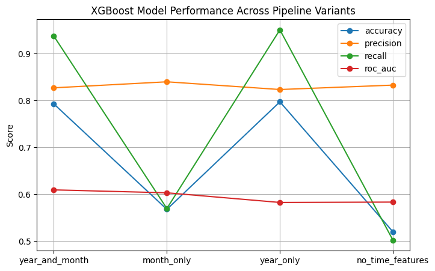

# 🌲 Forest Fire Prediction Project

**Predicting Wildfire Ignitions Across the US Using XGBoost and Random Forests**

---

## 📄 Project Overview

This project focuses on **predicting wildfire ignition events** in the continental United States (2014–2025) using environmental and meteorological data. The goal is to provide actionable insights for disaster response, climate–fire interaction studies, and spatiotemporal modeling.

We leverage the **FireCastRL dataset**, which combines GRIDMET daily weather variables with IRWIN wildfire ignition records, processed into 75-day sequences for binary classification.

---

## 🔹 Dataset

**Source:** [FireCastRL: GRIDMET + IRWIN spatiotemporal wildfire dataset (2014–2025)](https://www.kaggle.com/datasets/firecastrl/us-wildfire-dataset)
**Coverage:** Continental US, 2014–2025
**Samples:** 126,800 labeled events (50,720 positive, 76,080 negative)
**Sequence Length:** 75 days per sample
**Features:** 15 environmental variables (temperature, wind speed, fuel moisture, etc.) + target label (`Wildfire`)

**Preprocessing & Feature Engineering:**

* Target variable converted from `Yes/No` → `1/0`.
* Outliers removed for numerical features.
* Numerical variable `rmax` transformed into categorical bins (`rmax_label`) using quantile binning to handle skewed distribution.
* Temporal features extracted:

  * Month (cyclical: `month_sin`, `month_cos`)
  * Relative year (`years_since_start`)
* Balanced sampling applied for rare wildfire events in XGBoost experiments.

---

## 📁 Project Structure

```
forest_fire_prediction
├── README.md
├── data/
│   └── wildfire_data.parquet
├── get_prediction.py      # Helper functions and get_prediction() for inference
├── images/
│   ├── Wildfire Locations Colored by Humidity Level.png
│   ├── wildfire_locations.png
│   └── XGBoostModelPerformanceAcrossPipelineVariants.png
├── main.py                # Streamlit app for live predictions
├── models/
│   ├── month_only.pkl.gz
│   ├── no_time_features.pkl.gz
│   ├── wildfire_rf_balanced_classes_best_model.pkl.gz
│   ├── year_and_month.pkl.gz
│   └── year_only.pkl.gz
├── notebooks/
│   ├── forest_fire_binary_classification.ipynb
│   ├── forest_fire_eda.ipynb
│   ├── forest_fire_eda_part2.ipynb
│   ├── wild_fire_classification_V2.ipynb
│   └── wild_fire_classification_V3.ipynb
└── requirements.txt
```

---

## ⚙️ Installation

1. Clone the repository:

```bash
git clone https://github.com/your-username/forest_fire_prediction.git
cd forest_fire_prediction
```

2. Create a virtual environment and install dependencies:

```bash
python -m venv venv
source venv/bin/activate      # Linux/Mac
venv\Scripts\activate         # Windows
pip install -r requirements.txt
```

---

## 🚀 Usage

### Streamlit App

Run the app for live wildfire predictions:

```bash
streamlit run main.py
```

### Inference Helper

Use `get_prediction.py` to make predictions programmatically:

```python
from get_prediction import get_prediction

prediction = get_prediction(input_features)
print(prediction)
```

---

## 🧪 Experiments & Modeling

### Models Used

* **Random Forest Classifier**
* **XGBoost Classifier** (GPU accelerated)

### Pipeline

1. Feature engineering: time features (`month_sin`, `month_cos`, `years_since_start`) + categorical encoding (`rmax_label`)
2. Preprocessing: imputation, scaling
3. Model training & hyperparameter tuning using `RandomizedSearchCV`
4. Evaluation on temporal split (train on past years, test on last year)

### XGBoost Performance Across Pipeline Variants

| Experiment       | Accuracy | Precision | Recall | ROC AUC |
| ---------------- | -------- | --------- | ------ | ------- |
| year_and_month   | 0.793    | 0.827     | 0.938  | 0.609   |
| month_only       | 0.568    | 0.840     | 0.570  | 0.603   |
| year_only        | 0.797    | 0.824     | 0.951  | 0.582   |
| no_time_features | 0.520    | 0.833     | 0.502  | 0.583   |

**Key Insight:** Incorporating both **year and month** features leads to the most balanced performance across accuracy, precision, and recall.



---

### ✅ Why the “Year and Month” Pipeline Is the Best Choice

While multiple feature combinations were tested, the **year_and_month** model demonstrates the most consistent and well-balanced performance across all metrics:

* 📊 **Balanced Accuracy and Recall:**
  It achieved a strong accuracy score of **0.793** and a high recall of **0.938**, meaning it detects most wildfire occurrences while still maintaining overall prediction reliability.

* 🎯 **Reduced Risk of Missing Fires:**
  Although the **year_only** model has the highest recall (0.951), the year_and_month model offers only a small trade-off (-0.013) but provides better-balanced accuracy and precision.

* ⚖️ **Precision Remains High (0.827):**
  This indicates the model maintains a low false-positive rate, avoiding excessive false alarms while still being sensitive to true wildfire events.

* 🧠 **Temporal Awareness:**
  Using both year and month helps the model capture **seasonal wildfire trends** (e.g., dry seasons) as well as **long-term climate changes across years**, leading to better generalization and understanding of temporal patterns.

---

### ✅ Final Decision

The **XGBoost model with Year + Month features** was selected as the best-performing model due to its:

✔ Strong balance of accuracy, precision, and recall
✔ Ability to capture both long-term and seasonal wildfire trends
✔ Low model complexity while maintaining high predictive value

---

## 📊 EDA & Visualizations

* Wildfire location maps by humidity level
* Feature importance plots for Random Forest and XGBoost models
* Time-based wildfire trends

---

## 🔧 Next Steps / Improvements

* Include additional environmental variables (e.g., soil moisture, vegetation index)
* Explore sequence-based models (LSTM, Transformer) for 75-day sequences
* Deploy Streamlit app on cloud (AWS/GCP/Heroku) with real-time wildfire alerts
* Automate retraining with new data (2026+)

---

## 📚 References

* FireCastRL Dataset: GRIDMET + IRWIN (2014–2025)
* **Citation:**
  *Spatiotemporal Wildfire Prediction and Reinforcement Learning for Helitack Suppression, ICMLA 2025*

---